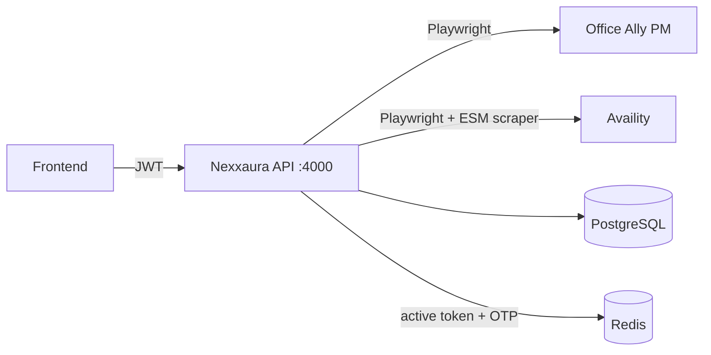

# Office Ally → Availity (Nexxaura main_server)

This document explains the **internal integration flow** in `main_server`: credentials, sync, MFA, and user-scoped data.

## High-level flow



## Sequence (one sync)

```mermaid
sequenceDiagram
  participant U as User
  participant G as Gateway API
  participant R as Redis
  participant P as Postgres

  U->>G: POST /api/auth/login
  G->>P: verify user
  G->>R: store active JWT
  G-->>U: access token

  U->>G: POST /api/sync/date-sync { appointmentDate }
  G->>P: lock/insert sync_requests=running
  G-->>U: 202 { syncRequestId }
  G->>G: background: OA scrape → save patients/appointments
  G->>G: Availity login; if MFA → P.awaiting_otp, poll R for code
  U->>G: POST /api/sync/otp { syncRequestId, code }
  G->>R: set sync:otp:*
  G->>G: continue eligibility, write availity_*
  G->>P: sync_requests=success
```

## Tables (conceptual)

| Area | Table | Scoping |
|------|--------|--------|
| App login | `users` | — |
| Vendors | `office_ally_credentials`, `availity_credentials` | `user_id` |
| Runs | `sync_requests` | `user_id` |
| Core data | `patients`, `appointments`, `patient_insurance` | `user_id` or via patient |
| Availity | `availity_eligibility_runs`, `availity_eligibility_results` | `user_id` on runs |

## Users & roles (RBAC)

- Column `users.role`: **`admin`**, **`doctor`**, **`staff`**, **`reception`**.
- **Admins** can create users: `POST /api/users` (requires admin JWT). Body: `email`, `fullName`, `password`, `role` (one of `doctor` | `staff` | `reception`). **Creating another `admin` via this API is disabled** (use DB or a future admin-only tool).
- Optional on create: `officeAlly: { username, password }` and `availity: { username, password }` — if you send one block, both fields in that block are required; omitted blocks mean that user has no vendor row until added later.
- Login response includes `user.role`. JWT payload includes `role` for the UI.
- Seed users (after `sql/seed.sql`): `demo@nexxaura.com` (doctor), `admin@nexxaura.com` / `admin123` (admin) — **change in production**.

## User-specific reads (REST)

All require `Authorization: Bearer <token>`:

- `GET /api/data/appointments`
- `GET /api/data/patients`
- `GET /api/data/patient-insurance`
- `GET /api/data/availity` — latest run per patient + latest result for that run
- `GET /api/data/dashboard` — bundles the above

## GraphQL

- `POST /graphql` (Bearer token) with body `{ "query": "{ dashboard { ... } }" }` — small aggregate for dashboards.

## Related code

- Pipeline: `src/services/pipelineService.js`
- OA client: `src/playwright/officeAllyClient.js`
- Availity login + MFA: `src/playwright/availityOtpFlow.js`
- ESM scraper (from monorepo): `../scripts/availity/src/eligibilityScraper.js` (or `ELIGIBILITY_SCRAPER_PATH`).
